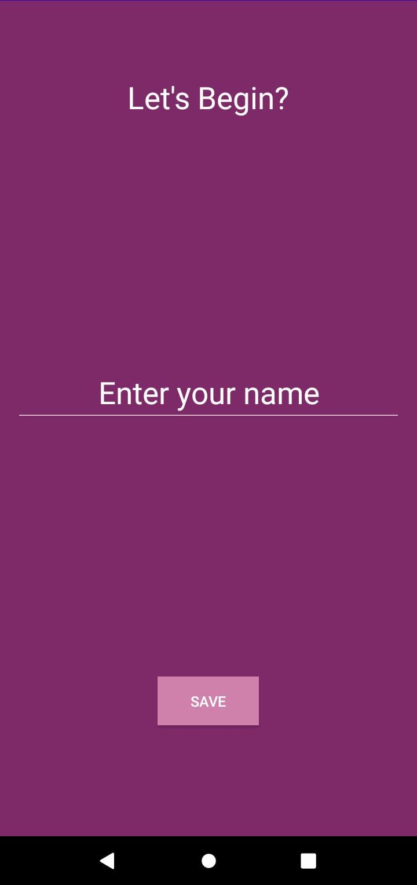
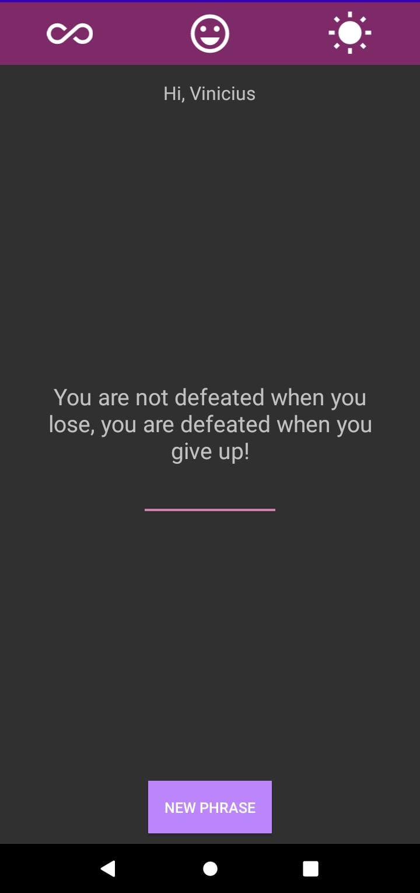

Motivation App 💡✨
A simple Android app to motivate you with personalized phrases and remember your name.

📱 Features
User name registration on first launch

Stores name using SharedPreferences

Displays motivational phrases filtered by categories: All, Happy, and Morning

Updates phrase on button click

Clean and easy-to-use UI

🛠️ Tech Stack
Kotlin

Android SDK

AndroidX libraries

View Binding

SharedPreferences for local persistence

📸 Screenshots

  

🚀 Getting Started
Clone this repository:
git clone <repository-url>

Open the project in Android Studio.

Let Gradle sync the project.

Connect your device or start an emulator.

Click Run ▶️ to launch the app.

✅ Requirements

Android Studio (Hedgehog or newer recommended)

JDK 8+

Gradle 8.0+

Android Gradle Plugin 8.5.1+

API 34 or higher in SDK

⚠️ Known Issues

Compatible only with AGP 8.0 or higher

kotlin-android-extensions is deprecated, so View Binding is used